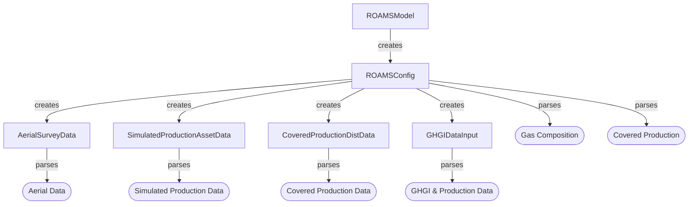
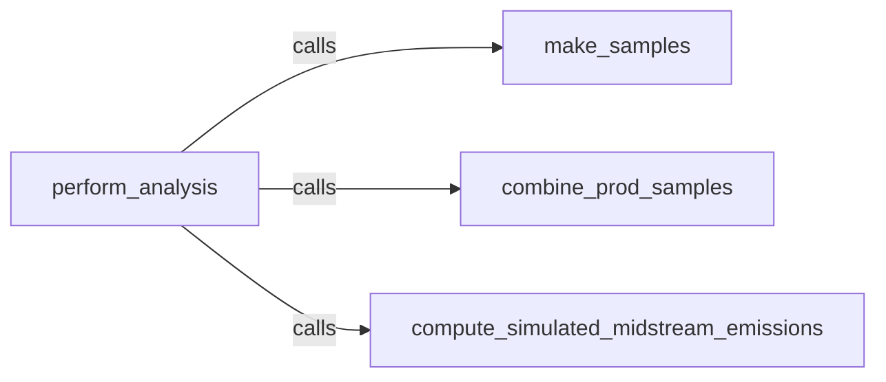
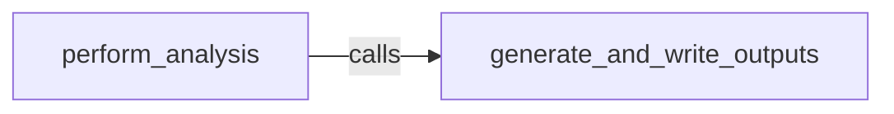

# Implementation

The code in this codebase is an attempt to implement the [methodology](#/docs/methodology.md) described elsewhere.

## Table of Contents

* [Summary](#summary)
* [Input Layer](#input-layer-and-behavior)
* [Processing Layer](#processing-layer)
* [Output Layer](#output-layer)

## Summary

The ROAMS methodology is embodied by the `perform_analysis` method of the `roams.model.ROAMSModel` class. This method creates samples, emissions estimates, and the outputs thereof. This method only calls four other methods, one of which generates the outputs:

| Method Name | Method Purpose |
| --- | --- |
| `make_samples` | Create aerial and simulated emissions samples |
| `combine_prod_samples` | Combined the simulated and aerial production emissions distributions|
| `compute_simulated_midstream_emissions` | Estimate the sub-detection-level midstream emissions |
| `generate_and_write_outputs` | Create and save some outputs |

The methodology requires data from several distinct sources. In an effort to maintain strict separation between the task of specifying the inputs (e.g. what column in this table holds the information we need? What unit is it in? How do we convert it to be usable?) and using them within the prescribed methodology, a lot of the code focuses specifically on making sense of the inputs, and providing entrypoints to the actual computation code. As such, the task of specifying and parsing inputs is put into an [Input Layer](#input-layer-and-behavior), whose job is fundamentally to make sense of the inputs and provide the relevant information to the part of the code that does the computation.

Within this workflow, the `ROAMSModel` class calls an instance of `ROAMSConfig` to parse the content of an input file (or input dictionary), which uses several distinct classes to make sense of different data sources. After this parsing is done within the `__init__` of the `ROAMSModel` class, one can call `perform_analysis()`.

After having parsed the input the [processing layer](#processing-layer), embodied by most of the guts of `ROAMSModel`, actually does stuff with the input information to execute the ROAMS methodology. It is finally up to the [output layer](#output-layer) to do something with all the computed results.

## Input Layer and Behavior
[back to top](#implementation)

The "Input Layer" is intended to abstract the task of input specification away from the computational parts of the codebase. It is fundamentally embodied by the `roams.input.ROAMSConfig` class, which is instantiated with a JSON input file or python dictionary (see the [README](/README.md) for specification) within the `__init__()` method of `ROAMSModel`.

The `ROAMSConfig` class parses the content of the file (or dictionary) by asserting that required inputs exist and are of the right type, then by filling in default values for non-required inputs. It will log warnings if inputs are provided that are neither required nor optional -- they won't be used by the code.

After parsing through the input file in this manner, it will use the specification, now filled with defaults where appropriate, to instantiate distinct input classes designed to parse specific data. See details below for how each specific input class handles input data. These classes are: [AerialSurveyData](#aerial-data-input-class), [SimulatedProductionAssetData](#simulated-data-input-class), [CoveredProductionDistData](#covered-production-data-input-class), and [GHGIDataInput](#ghgi--production-data-input-class)

### Aerial Data Input Class 
The input class for parsing aerial survey input data is `roams.aerial.input.AerialSurveyData`. 

It's expected that the aerial data is provided in two parts as csvs: plume data and source data. While plume data holds the information about plume size (and what sources they're coming from), the source data classifies the source types and number of fly-overs. The column names, and units thereof where necessary, are always expected to be provided.

When first instantiated, the `AerialSurveyData` class will assert that the prescribed columns exist, and that there's sufficient information to collect or infer emissions and wind-normalized emissions (via the relation `emissions [mass/time] = wind-normalized emissions [mass/time / speed] * windspeed [speed]`, if necessary). It will also segregate the dataset into different `asset_group`s, which are subsets of the source and plume data corresponding to specific prescribed source asset types. The subsets of the input data corresponding to each asset group are used in providing data to the ROAMSModel class. While the `AerialSurveyData` class doesn't have an opinion about what asset groups are specified, the `ROAMSConfig` will require that "production" and "midstream" are given - the `ROAMSModel` will require those.

The class provides several properties as entry points to the `ROAMSModel` class:

* `plume_emissions`: a dictionary of `asset group : emissions array` pairs, where the key is a string matching the name of a prescribed asset group. The array of emissions values will be converted into `COMMON_EMISSIONS_UNITS`, and in the same order as they would appear in the input data, after filtering for this asset type.
* `plume_wind_norm`: a dictionary of `asset group : wind-normalized emissions array` pairs, where the key is a string matching the name of a prescribed asset group. The array of wind normalized emissions values will be converted into `COMMON_WIND_NORM_EM_UNITS`, and in the same order as they would appear in the input data, after filtering for this asset type.
* `plume_windspeed`: a dictionary of `asset group : wind speed array` pairs, where the key is a string matching the name of a prescribed asset group. The array of wind speed values will be converted into `COMMON_WIND_SPEED_UNITS`, and in the same order as they would appear in the input data, after filtering for this asset type.

For more detail on unit handling, see the [unit handling section](#unit-handling).

### Simulated Data Input Class 
The input class for parsing simulated production emissions data is `roams.simulated.input.SimulatedProductionAssetData`.

This class will expect the data to be provided with a csv table that at least has a column holding simulated emissions values. A user also has to specify the units of these physical emissions values. If stratified re-sampling is intended to be done, this data should also have a simulated production column (and corresponding specified unit).

The class provides several properties as entrypoints to the `ROAMSModel` class:

* `simulated_emissions` : A `numpy.ndarray` of simulated emissions values from the input table, converted into units of `COMMON_EMISSIONS_UNITS`. The order is the same as that in the original data.
* `simulated_production` : A `numpy.ndarray` of simulated production values from the input table, converted into units of `COMMON_PRODUCTION_UNITS`. The order is the same as that in the original data.

For more detail on unit handling, see the [unit handling section](#unit-handling).

### Covered Production Data Input Class 
The input class for parsing covered production data is `roams.production.input.CoveredProductionDistData`.

This class expects that the covered production distribution data is passed as a csv file with a single column, whose name and physical units are specified. It's intended that this is a long list of values that embodies a distribution reflective of per-well production in the study region. It also requires passing a `gas_composition`, which is used to convert between natural gas and CH4.

The class provides three main properties that serve as entrypoints for the `ROAMSModel` to access the underlying data:

* `ng_production_dist_volumetric`: A `np.ndarray` containing the rate of volumetric production of natural gas for this representative collection of wells, in `COMMON_PRODUCTION_UNITS`. Will be in the same order as the input data.
* `ch4_production_dist_volumetric`: A `np.ndarray` containing the rate of volumetric production of CH4 for this representative collection of wells, in `COMMON_PRODUCTION_UNITS`. It uses the gas composition to make this conversion. Will be in the same order as the input data.
* `ch4_production_dist_mass`: A `np.ndarray` containing the rate of mass production of CH4 for this representative collection of wells, in `COMMON_EMISSIONS_UNITS`. It uses the gas composition and a fixed density assumption to compute this quantity. It will be in the same order as the input data.

For more detail on unit handling, see the [unit handling section](#unit-handling).

### GHGI & Production Data Input Class
The input class for parsing GHGI & State/National production data is `roams.midstream_ghgi.input.GHGIDataInput`.

This class takes a lot of distinct tables as inputs. It requires state & national production data, as well as several different tables that typically appear in the GHGI appendices. Aside from that, the units of quantities within the tables have to be specified, and the data year to use, as well as the state to use in creating estimates, have to be specified. Lastly, it has to be told what fraction of midstream emissions are aerially observable.

This particular input class has very specific opinions about how the data are formatted. You should look at the dummy data to ensure that your inputs are in the same form if you're experiencing problems.

The class provides two main properties to serve as entrypoints for the `ROAMSModel` to access the underlying data:
* `total_midstream_ch4_loss_rate` : The total rate of CH4 loss, expressed as a dimensionless and unitless ratio of `[CH4 emitted from midstream infrastructure]/[Total CH4 produced]`. It is the lesser of a state-level and national-level estimate. It will be a `pd.Series` with indices of `'low', 'mid', 'high'`. While the `'mid'` value is the computed estimate, the `'low'` and `'high'` values are estimated 95% confidence interval bounds inferred by reading and using very specific data from an input table.
* `submdl_midstream_ch4_loss_rate` : A fraction of `total_midstream_ch4_loss_rate`, representing only the portion that is presumably not aerially observable. It will be a `pd.Series` with indices of `'low', 'mid', 'high'`. While the `'mid'` value is the computed estimate, the `'low'` and `'high'` values are estimated 95% confidence interval bounds inferred by reading and using very specific data from an input table.

For more detail on unit handling, see the [unit handling section](#unit-handling).

### Unit Handling
Each class in the input layer is responsible for furnishing quantities of interest to the `ROAMSModel` in known, constant units. The common units of computation to be used are in `roams.constants`. After having used values from the inputs to create and quantify new results, it is intended that it can be confident of the units of these quantities - specifically that they are in these common units.

The logic of converting units within the input layer is handled by `roams.utils.convert_units`, and in a few places `roams.utils.ch4_volume_to_mass` and `roams.utils.energycontent_mj_mcf`. These use fixed physical and conversion assumptions to convert between small sets of prescribed units. It is completely expected that the incorporation of novel units will break this code, even if fundamentally consistent with the rest of the analysis.

## Processing Layer
[back to top](#implementation)

The "processing layer" is embodied in most of the guts of the `ROAMSModel` class, and contains an implementation of the [ROAMS Methodology](#/docs/methodology.md). This logic is executed in three steps: [making samples](#make_samples), [combining simulated & aerial production distributions](#combined_prod_samples), and [computing an estimate of sub-detection-level midstream emissions](#compute_simulated_midstream_emissions), which are executed in this order within `perform_analysis()`.

### make_samples

The goal of this method is to establish samples of the simulated production emissions, aerially measured production emissions, and aerially measured midstream emissions. By the end of this method, the following attributes should be defined:

* `simulated_sample`: A `np.ndarray`  whose shape is [number of wells to simulate] x [number of monte-carlo iterations]. Should be filled with (column-wise) sorted ascending values of simulated emissions values in `COMMON_EMISSIONS_UNITS`, which may or may not have been re-sampled with stratification.
* `prod_tot_aerial_sample`: A `np.ndarray` whose shape is [number of wells to simulate] x [number of monte-carlo iterations]. Should be filled with mostly 0s, in all likelihood, with (column-wise) sorted ascending aerially measured, sampled, and adjusted emissions values in `COMMON_EMISSIONS_UNITS`.
* `prod_partial_detection_emissions`: A `np.ndarray` whose shape is [number of wells to simulate] x [number of monte-carlo iterations]. Each value in this table is the partial detection correction for corresponding values in `prod_tot_aerial_sample` (e.g. the value in the 10th row and 9th column is the partial detection correction for the emissions value at the 10th row and 9th column of `prod_tot_aerial_sample`).
* `midstream_tot_aerial_sample`: A `np.ndarray` whose shape is [number of measured midstream sources] x [number of monte-carlo iterations]. Should represent a sample of adjusted and perhaps noised emissions from midstream infrastructure, without any padding zeros to represent infrastructure surveyed but not emitting.
* `midstream_partial_detection_emissions`: A `np.ndarray` whose shape is [number of measured midstream sources] x [number of monte-carlo iterations]. Each value in this table is the partial detection correction for corresponding values in `midstream_tot_aerial_sample` (e.g. the value in the 10th row and 9th column is the partial detection correction for the emissions value at the 10th row and 9th column of `midstream_tot_aerial_sample`).

### combined_prod_samples

The goal of this method is to combine the distinct distributions of production emissions based on a sampling of aerial measurement, and simulated results. It will find the transition point for each monte-carlo iteration, if one is not prescribed in the input file, and then combine distributions in each iteration.

In order to combine the simulated and aerially sampled emissions distributions in each monte-carlo iteration, it functionally follows these steps:

1. Instantiate the combined distribution as a copy of the aerial emissions sample of these `W` wells (this will include many 0s).
2. Identify all the simulated emissions less than the transition point in this iteration (this will be a number of values `w`<`W`, in all likelihood)
3. Find the first index in the combined distribution where emissions are at least equal to the transition point
4. Replace all the values up before this index with a sample (w/ replacement) from the `w` simulated emissions values below the transition point.
    * The code will raise an error if `w` is less than the number of slots to fill.
5. Re-sort the resulting list of emissions values ascending, including the corresponding partial detection values.

The result of this method is the definition of two new attributes:

* `combined_samples`: A `np.ndarray` whose shape is [number of wells to simulate] x [number of monte-carlo iterations]. Should be filled with (column-wise) sorted ascending values of emissions in `COMMON_EMISSIONS_UNITS`, representing the estimated emissions of some well in the study region.
* `prod_partial_detection_emissions`: A `np.ndarray`  whose shape is [number of wells to simulate] x [number of monte-carlo iterations].  Each value in this table is the partial detection correction for corresponding values in `combined_samples` (e.g. the value in the 10th row and 9th column is the partial detection correction for the emissions value at the 10th row and 9th column of `combined_samples`).

### compute_simulated_midstream_emissions

The goal of this method is to compute the estimated sub-detection-level midstream emissions, as well as total midstream emissions estimated per available GHGI and production data.

In each case, the relevant emissions quantity is computed as `[CH4 loss rate] * [CH4 production in the study region]`. 

* `submdl_ch4_midstream_emissions`: A `pd.Series` representing an estimate of sub-detection-level midstream emissions and lower- and upper- 95% confidence interval bounds. This is in `COMMON_EMISSIONS_UNITS`.
* `total_ch4_midstream_emissions`: A `pd.Series` representing an estimate of total midstream emissions and lower- and upper- 95% confidence interval bounds. This is in `COMMON_EMISSIONS_UNITS`.

## Output Layer
[back to top](#implementation)

The "output layer" is supposed to be an abstraction of the task of generating human-readable (and/or machine usable) results based on what was computed in the processing layer. Currently, this is barely abstracted at all, and is entirely embodied in the last part of `perform_analysis()` of the `ROAMSModel` class, via the [generate_and_write_outputs](#generate_and_write_outputs) method.

### generate_and_write_outputs

This method is responsible for generating outputs based on what was computed in the processing layer. It will:

1. Make an output folder if it doesn't exist (this will be `"run_results/<foldername from input file>"`). All the outputs will be saved here.
2. Save a copy of the parsed input file, with applied defaults and everything.
    * Note that if the input was passed as a python dictionary with custom defined functions, only the names will be saved. Other users without the function definition won't be able to re-use the input file.
3. Create tabular outputs by calling `make_tablar_outputs()`, which just calls a sequence of other methods. Each method is responsible for putting a `pd.DataFrame` into the `self.table_outputs` dictionary. The key under which the DataFrame is saved will be the filename.
4. Go through each of the `name : pd.DataFrame` item pairs in `self.table_outputs` and save the DataFrame without it's index as a csv file with that name.
5. Call `gen_plots()` to create and save desired plots to the output folder.