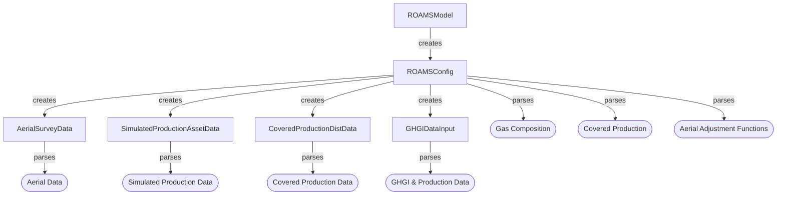
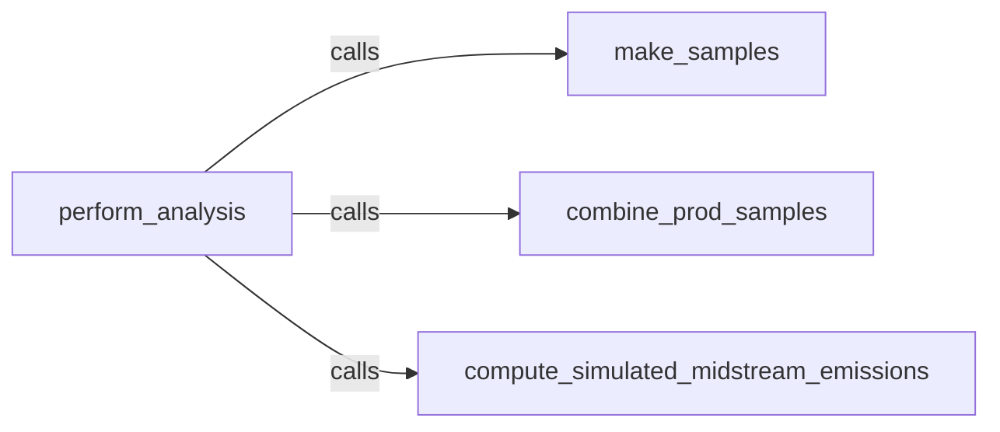
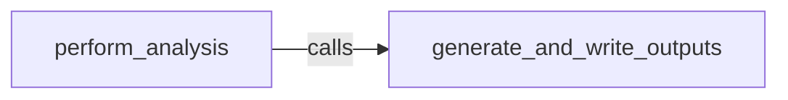

# Implementation
[Back to README](/README.md)

The code in this codebase is an attempt to implement the [methodology](/docs/methodology.md) described elsewhere.

## Table of Contents

* [Summary](#summary)
* [Input Layer](#input-layer-and-behavior)
* [Processing Layer](#processing-layer)
* [Output Layer](#output-layer)
* [Tests & Validation](#tests-and-validation)
* [Computational Resources](#computational-resources)

## Summary

The ROAMS methodology is embodied by the `perform_analysis` method of the `roams.model.ROAMSModel` class. This method creates samples, emissions estimates, and the outputs thereof. This method only calls four other methods, one of which generates the outputs:

| Method Name | Method Purpose |
| --- | --- |
| `make_samples` | Create aerial and simulated emissions samples |
| `combine_prod_samples` | Combined the simulated and aerial production emissions distributions|
| `compute_simulated_midstream_emissions` | Estimate the sub-detection-level midstream emissions |
| `generate_and_write_outputs` | Create and save some outputs |

The methodology requires data from several distinct sources. In an effort to maintain strict separation between the task of specifying the inputs (e.g. what column in this table holds the information we need? What unit is it in? How do we convert it to be usable?) and using them within the prescribed methodology, a lot of the code focuses specifically on making sense of the inputs, and providing entrypoints to the actual computation code. As such, the task of specifying and parsing inputs is put into an [Input Layer](#input-layer-and-behavior), whose job is fundamentally to make sense of the inputs and provide the relevant information to the part of the code that does the computation.

Within this workflow, the `ROAMSModel` class calls an instance of `ROAMSConfig` to parse the content of an input file (or input dictionary), which uses several distinct classes to make sense of different data sources. After this parsing is done within the `__init__` of the `ROAMSModel` class, one can call `perform_analysis()`.

After having parsed the input the [processing layer](#processing-layer), embodied by most of the guts of `ROAMSModel`, actually does stuff with the input information to execute the ROAMS methodology. It is finally up to the [output layer](#output-layer) to do something with all the computed results.

## Input Layer and Behavior
[back to top](#implementation)

The "Input Layer" is intended to abstract the task of input specification away from the computational parts of the codebase. It is fundamentally embodied by the `roams.input.ROAMSConfig` class, which is instantiated with a JSON input file or python dictionary (see the [README](/README.md) for specification) within the `__init__()` method of `ROAMSModel`.

The `ROAMSConfig` class parses the content of the file (or dictionary) by asserting that required inputs exist and are of the right type, then by filling in default values for non-required inputs. For all known input values, it will assign an attribute to itself with the input key as the attribute name, and the input value as the attribute value. It will log warnings if inputs are provided that are neither required nor optional -- they won't be used by the code.

After parsing through the input file in this manner, it will use the specification, now filled with defaults where appropriate, to instantiate distinct input classes designed to parse specific data. See details below for how each specific input class handles input data. These classes are: [AerialSurveyData](#aerial-data-input-class), [SimulatedProductionAssetData](#simulated-data-input-class), [CoveredProductionDistData](#covered-production-data-input-class), and [GHGIDataInput](#ghgi--production-data-input-class)

Jump ahead to any of the specific input behaviors:

* [AerialSurveyData](#aerial-adjustment-functions)
* [SimulatedProductionAssetData](#simulated-data-input-class)
* [CoveredProductionDistData](#covered-production-data-input-class)
* [GHGIDataInput](#ghgi--production-data-input-class)
* [Gas Composition](#gas-composition)
* [Covered Production](#covered-production)
* [Aerial Adjustment Functions](#aerial-adjustment-functions)

### Aerial Data Input Class 
[go back to input layer](#input-layer-and-behavior)
The input class for parsing aerial survey input data is `roams.aerial.input.AerialSurveyData`. 

It's expected that the aerial data is provided in two parts as csvs: plume data and source data. While plume data holds the information about plume size (and what sources they're coming from), the source data classifies the source types and number of fly-overs. The column names, and units thereof where necessary, are always expected to be provided.

When first instantiated, the `AerialSurveyData` class will assert that the prescribed columns exist, and that there's sufficient information to collect or infer emissions and wind-normalized emissions (via the relation `emissions [mass/time] = wind-normalized emissions [mass/time / speed] * windspeed [speed]`, if necessary). It will also segregate the dataset into different `asset_groups`, which are subsets of the source and plume data corresponding to specific prescribed source asset types. The subsets of the input data corresponding to each asset group are used in providing data to the ROAMSModel class. While the `AerialSurveyData` class doesn't have an opinion about what asset groups are specified, the `ROAMSConfig` will require that "production" and "midstream" are given - the `ROAMSModel` will require those.

The class provides several properties as entry points to the `ROAMSModel` class:

* `plume_emissions`: a dictionary of `asset group : emissions array` pairs, where the key is a string matching the name of a prescribed asset group. The array of emissions values will be converted into `COMMON_EMISSIONS_UNITS`, and in the same order as they would appear in the input data, after filtering for this asset type.
* `plume_wind_norm`: a dictionary of `asset group : wind-normalized emissions array` pairs, where the key is a string matching the name of a prescribed asset group. The array of wind normalized emissions values will be converted into `COMMON_WIND_NORM_EM_UNITS`, and in the same order as they would appear in the input data, after filtering for this asset type.
* `plume_windspeed`: a dictionary of `asset group : wind speed array` pairs, where the key is a string matching the name of a prescribed asset group. The array of wind speed values will be converted into `COMMON_WIND_SPEED_UNITS`, and in the same order as they would appear in the input data, after filtering for this asset type.

For more detail on unit handling, see the [unit handling section](#unit-handling).

### Simulated Data Input Class 
[go back to input layer](#input-layer-and-behavior)
The input class for parsing simulated production emissions data is `roams.simulated.input.SimulatedProductionAssetData`.

This class will expect the data to be provided with a csv table that at least has a column holding simulated emissions values. A user also has to specify the units of these physical emissions values. If stratified re-sampling is intended to be done, this data should also have a simulated production column (and corresponding specified unit).

The class provides several properties as entrypoints to the `ROAMSModel` class:

* `simulated_emissions` : A `numpy.ndarray` of simulated emissions values from the input table, converted into units of `COMMON_EMISSIONS_UNITS`. The order is the same as that in the original data.
* `simulated_production` : A `numpy.ndarray` of simulated production values from the input table, converted into units of `COMMON_PRODUCTION_UNITS`. The order is the same as that in the original data.

For more detail on unit handling, see the [unit handling section](#unit-handling).

### Covered Production Data Input Class 
[go back to input layer](#input-layer-and-behavior)
The input class for parsing covered production data is `roams.production.input.CoveredProductionDistData`.

This class expects that the covered production distribution data is passed as a csv file with a single column, whose name and physical units are specified. It's intended that this is a long list of values that embodies a distribution reflective of per-well production in the study region. It also requires passing a `gas_composition`, which is used to convert between natural gas and CH4.

The class provides three main properties that serve as entrypoints for the `ROAMSModel` to access the underlying data:

* `ng_production_dist_volumetric`: A `np.ndarray` containing the rate of volumetric production of natural gas for this representative collection of wells, in `COMMON_PRODUCTION_UNITS`. Will be in the same order as the input data.
* `ch4_production_dist_volumetric`: A `np.ndarray` containing the rate of volumetric production of CH4 for this representative collection of wells, in `COMMON_PRODUCTION_UNITS`. It uses the gas composition to make this conversion. Will be in the same order as the input data.
* `ch4_production_dist_mass`: A `np.ndarray` containing the rate of mass production of CH4 for this representative collection of wells, in `COMMON_EMISSIONS_UNITS`. It uses the gas composition and a fixed density assumption to compute this quantity. It will be in the same order as the input data.

For more detail on unit handling, see the [unit handling section](#unit-handling).

### GHGI & Production Data Input Class
[go back to input layer](#input-layer-and-behavior)
The input class for parsing GHGI & State/National production data is `roams.midstream_ghgi.input.GHGIDataInput`.

This class takes a lot of distinct tables as inputs. It requires state & national production data, as well as several different tables that typically appear in the GHGI appendices. Aside from that, the units of quantities within the tables have to be specified, and the data year to use, as well as the state to use in creating estimates, have to be specified. Lastly, it has to be told what fraction of midstream emissions are aerially observable.

This particular input class has very specific opinions about how the data are formatted. You should look at the dummy data to ensure that your inputs are in the same form if you're experiencing problems.

The class provides two main properties to serve as entrypoints for the `ROAMSModel` to access the underlying data:
* `total_midstream_ch4_loss_rate` : The total rate of CH4 loss, expressed as a dimensionless and unitless ratio of `[CH4 emitted from midstream infrastructure]/[Total CH4 produced]`. It is the lesser of a state-level and national-level estimate. It will be a `pd.Series` with indices of `'low', 'mid', 'high'`. While the `'mid'` value is the computed estimate, the `'low'` and `'high'` values are estimated 95% confidence interval bounds inferred by reading and using very specific data from an input table (see below).
* `submdl_midstream_ch4_loss_rate` : A fraction of `total_midstream_ch4_loss_rate`, representing only the portion that is presumably not aerially observable. It will be a `pd.Series` with indices of `'low', 'mid', 'high'`. While the `'mid'` value is the computed estimate, the `'low'` and `'high'` values are estimated 95% confidence interval bounds inferred by reading and using very specific data from an input table.

With each point estimate, the 95% confidence interval is inferred by using the the 95% confidence interval for CH4 and non-combustion CO2 emissions from natural gas systems (Supplementary table 3-74 in GHGI 2022), specifically the lower- and upper-bounds given as percentage changes from the average. These percentage differences are applied to the point estimate and represented as the lower- and upper-confidence bounds for that value.

For more detail on unit handling, see the [unit handling section](#unit-handling).

### Gas Composition
[go back to input layer](#input-layer-and-behavior)

The gas composition is passed as a dictionary with keys taken from the list: `"c1", "c2", "c3", "nc4", "ic4", "nc5", "ic5", "c6+, "h2s", "h2"`, to be parsed directly by `ROAMSConfig`. The keys are representative of the molecular composition of natural gas analyzed in the region (C1 = methane, C2 = ethane, C3 = propane,..., nc4 = N-butane, ...). The values under each key should be a number at least 0 and at most 1. They should add up to a number at least 0.8, and below 1, the idea being that not all of the content gas may be important to account for, and may not even be knowable. This composition will primarily be used to convert amounts of natural gas into amounts of methane, but will also be used to define the energy content of natural gas, per logic in `roams.utils`.

### Covered Production
[go back to input layer](#input-layer-and-behavior)

The `ROAMSConfig` has two properties intended to serve as entrypoints for the `ROAMSModel` to access the total methane production in the study region: `ch4_total_covered_production_mass` and `ch4_total_covered_production_volume`, which are the emissions rate (in `COMMON_EMISSIONS_UNITS`) and volumetric emissions rate (in `COMMON_PRODUCTION_UNITS`), respectively. This is a direct conversion of the input that describes total natural gas production in the study region.

This is distinct from the data used in [CoveredProductionDistData](#covered-production-data-input-class), which embodies an estimated distribution of production, but does not provide an estimate of overall production in the study region.

For more detail on unit handling, see the [unit handling section](#unit-handling).

### Aerial Adjustment Functions
[go back to input layer](#input-layer-and-behavior)

The process for sampling and adjusting the measured plumes (described in [that part of the methodology](/docs/methodology.md#aerial-emissions-quantification)) includes several functions: one to do a deterministic mean correction, one to apply noise to help simulate error, one to determine the probability of detection, and another to choose what to do with noised values below 0.

The mean correction is given by the input argument `"correction_fn"`, which defaults to `None` (in which case no correction is applied). Alternatively, you can provide it as a dictionary with a `"name"` key whose value is the name of a method in `roams.aerial.assumptions`. The remaining key : value pairs should be the parameters to pass (like `slope` for `roams.aerial.assumptions.linear`)

For the noise function, provided with the input argument `"noise_fn"`, the input is expected to be passed as a dictionary with at least a key `"name"`. The string value under this key should be a method that can be looked up within `numpy.random`. The remaining key: value pairs in the dictionary should be parameter arguments for that noise function (except for `size`, which the code will supply based on the sampled aerial data to apply the noise to). The application of the described function is controlled by the argument `"simulate_error"` (`True` = apply the noise function, `False` = don't apply any given noise function). The default noise to apply is N(1.0, 0.39). The specified noise function will be used to generate noise that will be applied multiplicatively to sampled and mean-corrected aerial observations. For example `{"name":"normal","loc":2.0,"scale":1.0}` would specify a noise distribution drawn from N(2,1), which will then be applied multiplicatively with sampled aerial observations.

It's possible that after applying random noise to your sample, there are emissions values below 0. The default behavior to handle values below 0 is in `roams.assumptions.zero_out`, which will set values below 0 to 0. As-is, to invoke other behavior you would have to define new functions in your cloned repository's `roams.aerial.assumptions` or at run-time when passing an input to your `ROAMSModel`.

The probability of detection function is named as `"PoD_fn"` in the input file. This is the name of a function in `roams.aerial.partial_detection`. Unlike other paremetrized functions, this is hard-coded because it's unclear how this probability can clearly be parametrized for a general case.

If you instantiate the `ROAMSConfig` input as a dictionary (as opposed to a file on disk) and provide a defined function, the `ROAMSConfig` will use the defined function instead of trying to look it up. The caveat is that the saved config will only contain the name of your defined function, so other users will not be able to use it - the name of that function won't exist in the places where it will look for them.

### Unit Handling
Each class in the input layer is responsible for furnishing quantities of interest to the `ROAMSModel` in known, constant units. The common units of computation to be used are in `roams.constants`. After having used values from the inputs to create and quantify new results, it is intended that it can be confident of the units of these quantities - specifically that they are in these common units.

The logic of converting units within the input layer is handled by `roams.utils.convert_units`, and in a few places `roams.utils.ch4_volume_to_mass` and `roams.utils.energycontent_mj_mcf`. These use fixed physical and conversion assumptions to convert between small sets of prescribed units. It is completely expected that the incorporation of novel units will break this code, even if fundamentally consistent with the rest of the analysis.

## Processing Layer
[back to top](#implementation)

The "processing layer" is embodied in most of the guts of the `ROAMSModel` class, and contains an implementation of the [ROAMS Methodology](/docs/methodology.md). This logic is executed in three steps: [making samples](#make_samples), [combining simulated & aerial production distributions](#combined_prod_samples), and [computing an estimate of sub-detection-level midstream emissions](#compute_simulated_midstream_emissions), which are executed in this order within `perform_analysis()`.

### make_samples

The goal of this method is to establish samples of the simulated production emissions, and aerially measured emissions (at least for specified production and midstream infrastructure in the `asset_groups` argument, but also whatever other asset groups are specified there). By the end of this method, the following attributes should be defined:

* `simulated_sample`: A `np.ndarray`  whose shape is [number of wells to simulate] x [number of monte-carlo iterations]. Should be filled with (column-wise) sorted ascending values of simulated emissions values in `COMMON_EMISSIONS_UNITS`, which may or may not have been re-sampled with stratification. This is created by `make_simulated_sample`.
* `aerial_samples`: A dictionary of of {string : tuple} pairs. Each string key is a `lower()`-ed asset group name provided in the input file (`"asset_groups"`, see README), of which there should always be `"production"` and `"midstream"`, but you may specify more. The tuple values are a pair of (sampled adjusted and noised emissions , partial detection correction). Each of those values is an array of size [number of emitting sources] x [number of monte carlo iterations]. The partial detection corrections correspond elementwise to emissions in the same tuple pair. These samples represent the results of the aerial sampling and adjustment procedure for each asset group specified in your input file. This is created by `make_aerial_samples`

#### make_simulated_sample

The `make_simulated_sample` method is very simplistic. If directed to stratify the simulated emissions (via `"stratify_sim_sample"`), it will use the prevalence of covered productivity distribution in simulated productivity quantiles (quantiles that are pre-set) to generate re-weighted samples of the simulated emissions, so that associated well-site-level productivity is more representative of estimated "real" well site productivity. The method `stratify_sample` from `roams.simulated.stratify` performs this operation. One of the crucial arguments to this function is `quantiles`, which defines which quantiles of simulated production will be computed and used for the analysis. The default of this argument is `roams.simulated.stratify._QUANTILES`, and is in 10% increments up to the median, then 5% increments up to 95%, then 1% increments up to 99%, then goes to 99.5%, then 0.1% increments up to 100%. There isn't a super easy way to change what quantiles are used in the stratification process. But it would suffice to overwrite the `make_simulated_sample` method in a child class with a copy of the original content, and pass your own `quantiles=` keyword argument with your quantiles of interest.

**NOTE** that the code expects the covered productivity distribution file (`"covered_productivity_dist_file"` in the input) is a *well-level* (rather than *well-site level*) quantification of covered productivity. The code will very roughly translate the *well-level* distribution of productivity to a *well-site level* distribution of productivity by scaling each value in the distribution by the average number of wells per site (`"wells_per_site"` in the input). Based on the size of the pre-set quantiles, it should contain a value for each quantile bin from 0% to 100%, in uniform increments of at most 0.1%. This is because the smallest pre-set quantile bin has a size of 0.1%. It's important that the bins are uniform, because the code fundamentally expects each bin to be the same size for the math to work out (i.e. the number of values that fall within a certain range is exactly proportional to the fraction of well sites whose productivity falls within that range).

If not directed to do stratified sampling, it will just sample with replacement from the provided simulated emissions values to produce an emissions size distribution for each monte-carlo iteration.

#### make_aerial_samples

The `make_aerial_samples` function will iterate through each of the `asset_groups` specified in the input and perform the same sampling, adjustment, and noising to each. The result for each is two tables: one of sampled, adjusted, and noised emissions, and another of the corresponding partial detection correction for each observation. The values in the tables correspond by index: the emissions value in the 10th row and 15th column has a partial detection correction equal to the value in the 10th row and 15th column of the partial detection correction table. 

### combined_prod_samples

The goal of this method is to combine the distinct distributions of production emissions based on a sampling of aerial measurement, and simulated results. It will find the transition point for each monte-carlo iteration, if one is not prescribed in the input file, and then combine distributions in each iteration.

In order to combine the simulated and aerially sampled emissions distributions in each monte-carlo iteration, it functionally follows these steps:

1. Instantiate the combined distribution as a copy of the aerial emissions sample of these `W` wells (this will include many 0s).
2. Identify all the simulated emissions less than the transition point in this iteration (this will be a number of values `w`<`W`, in all likelihood)
3. Find the first index in the combined distribution where emissions are at least equal to the transition point
4. Replace all the values up before this index with a sample (w/ replacement) from the `w` simulated emissions values below the transition point.
    * The code will raise an error if `w` is less than the number of slots to fill.
5. Re-sort the resulting list of emissions values ascending, including the corresponding partial detection values.

The result of this method is the definition of two new attributes:

* `prod_combined_samples`: A `np.ndarray` whose shape is [number of wells to simulate] x [number of monte-carlo iterations]. Should be filled with (column-wise) sorted ascending values of emissions in `COMMON_EMISSIONS_UNITS`, representing the estimated emissions of some well in the study region.
* `prod_partial_detection_emissions`: A `np.ndarray`  whose shape is [number of wells to simulate] x [number of monte-carlo iterations].  Each value in this table is the partial detection correction for corresponding values in `combined_samples` (e.g. the value in the 10th row and 9th column is the partial detection correction for the emissions value at the 10th row and 9th column of `combined_samples`).

### compute_simulated_midstream_emissions

The goal of this method is to compute the estimated sub-detection-level midstream emissions, as well as total midstream emissions estimated per available GHGI and production data.

In each case, the relevant emissions quantity is computed as `[CH4 loss rate] * [CH4 production in the study region]`. 

* `submdl_ch4_midstream_emissions`: A `pd.Series` representing an estimate of sub-detection-level midstream emissions and lower- and upper- 95% confidence interval bounds. This is in `COMMON_EMISSIONS_UNITS`.
* `total_ch4_midstream_emissions`: A `pd.Series` representing an estimate of total midstream emissions and lower- and upper- 95% confidence interval bounds. This is in `COMMON_EMISSIONS_UNITS`.

## Output Layer
[back to top](#implementation)

The "output layer" is supposed to be an abstraction of the task of generating human-readable (and/or machine usable) results based on what was computed in the processing layer. Currently, this is barely abstracted at all, and is entirely embodied in the last part of `perform_analysis()` of the `ROAMSModel` class, via the [generate_and_write_outputs](#generate_and_write_outputs) method. In some tabular outputs, confidence intervals are provided for value estimates. Their derivation is described in [representing uncertainty](#representing-uncertainty).

### generate_and_write_outputs

This method is responsible for generating outputs based on what was computed in the processing layer. It will:

1. Make an output folder if it doesn't exist (this will be `"run_results/<foldername from input file>"`). All the outputs will be saved here.
2. Save a copy of the parsed input file, with applied defaults and everything.
    * Note that if the input was passed as a python dictionary with custom defined functions, only the names will be saved. Other users without the function definition won't be able to re-use the input file.
3. Create tabular outputs by calling `make_tablar_outputs()`, which just calls a sequence of other methods. Each method is responsible for putting a `pd.DataFrame` into the `self.table_outputs` dictionary. The key under which the DataFrame is saved will be the filename.
4. Go through each of the `name : pd.DataFrame` item pairs in `self.table_outputs` and save the DataFrame without it's index as a csv file with that name.
5. Call `gen_plots()` to create and save desired plots to the output folder.

### Representing uncertainty

The methodology implemented here results in a collection of simulated production emissions and sampled aerial emissions distributions. From this collection, the code uses estimators (like `sum`) to create a collection of point estimates. Here is how the code determines upper- and lower-bound confidence intervals from this collection of estimates:

1. Look at the range of estimates, and find the 2.5th and 97.5th percentile values (using `np.quantile`)
2. Find the difference between each and the mean estimate
3. Divide each difference by the square root of the average number of well site visits (`sqrt([total well visits / wells per site]/sites to simulate)`)
4. Define each bound as the mean ± this corrected difference.

This is implemented in the method `mean_and_quantiles_fromsamples`, which takes an array of length `N` (where it's expected that `N` is the number of monte-carlo samples), and will return a `pd.Series` whose indices are `"Avg"`, `"2.5% CI"`, and `"97.5% CI"`.

This methodology is also detailed in the [original research](https://doi.org/10.1038/s41586-024-07117-5).

## Tests and Validation
[back to top](#implementation)

Unit tests exist to assert that specific behavior occurs in specific points in the code. They all live in `roams/tests/`. Each test file (`"test_<name>.py"`) contains tests for a specific part of the code described above. They assert that errors are raised in the presence of specific inputs or context, that units are being handled as expected (as applicable), and that returned values match expectation exactly. In total, these tests cover:

* Aerial input behavior
* Simulated input behavior
* GHGI & Production input behavior
* Covered production input behavior
* ROAMSConfig input behavior
* ROAMSModel computation behavior
* Stratification computation behavior
* Transition point computation behavior
* Unit conversion functionality

These tests are hopefully comprehensive enough, but obviously no test suite can be perfect. Passing tests are a good sign that changes have not broken anything, but not proof. You will always require some human judgement to have confidence that passing tests do in fact cover all the important behavior, and are usefully testing important components. Failing tests almost certainly mean that something - perhaps even some tests themselves - need to be changed.

### Validation

"Validation", in this context, means checking the results produced by this code with results produced by a different implementation of the same model. The results produced by this python model have been validated against a prior implementation of this model (used for [this paper](https://doi.org/10.1038/s41586-024-07117-5)) in Analytica - proprietary GUI-based modeling software. A part of this codebase (in `roams/tests/validation/deterministic_validation.py`) define a deterministic version of the generic `ROAMSModel`, and execute the logic on a small dataset. 

In a small `unittest.TestCase` in that file, it asserts that the results of this run exactly match that produced by Analytica. These unit tests are included in the unit test suite. You can also run this validation exercise as a script (`python roams/tests/validation/deterministic_validation.py`) to run that version of the model and get a `"_deterministic_validation_exercise"` set of results saved to your `run_results` folder. These results likely won't be very interesting to you UNLESS you have access to the Analytica model run on the same input values.

## Computational Resources
[back to top](#implementation)

Memory is the primary resource demanded by the `ROAMSModel`. The amount of memory used is fundamentally tied to only a few inputs:

* The number of monte-carlo iterations
* The number of well sites being simulated with a production distribution.

The implementation can be quite demanding of memory, which is a sacrifice it makes to be able to take advantage of speedy numpy operations to the utmost.

There are 5 tables that are supposed have [num wells to simulate] rows and [number of MC iterations] columns. If there are O(10,000) wells to simulate, and O(1000) monte carlo iterations, such a table would hold O(1e8) 64-bit floats, which is about 800MB per table, which can be about 4GB of space total, not to speak of intermediary tables used during computation. This may be restrictive on some machines. For larger basins (~100,000 wells to simulate), it may be worth it to cast the emissions as a 32-bit float in an inherited `ROAMSModel` class, and/or use a smaller number of monte-carlo iterations.

In early development experience (with ~20k wells to simulate, 1000 monte carlo iterations, ~600 emitting production sources and ~300 emitting midstream sources), the tables above were using ~150MB each. The analysis took about ~15 sec, of which about a third of the time is creating all of the sample tables, a third of the time is computing the transition point, and a third of the time is writing outputs (a relatively small fraction is used to read data and do everything else). It's not expected for time to be a serious consideration, especially when running the ROAMS code in a parallelizable script