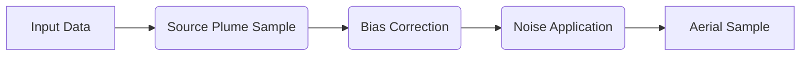

# ROAMS Methodology
[Back to README](/README.md)

This part of the documentation describes the implemented methodology in a mostly code-agnostic way. The implementation of this methodology, and other decisions made around it, are described in the [implementation documentation](/docs/implementation.md)

For a more detailed description of the methodology, you can review the methods in [Sherwin et al, 2024](https://doi.org/10.1038/s41586-024-07117-5), upon which ROAMS is based.

## Table of Contents

* The [summary](#summary) provides a quick overview of the purpose and primary inputs to the methodology, as well as the primary outputs
* The [aerial emissions](#aerial-emissions-quantification) section describes how aerial emissions observations are used to generate distributions
    * The [partial detection correction](#partial-detection-correction) section describes this accounting of unobserved emissions that are still above the minimum detection level
* The [simulated emissions](#simulated-emissions-quantification) section describes how simulated emissions from production 
* The [combining production distributions](#combining-production-distributions)
* The [GHGI-based Emissions quantification](#ghgi-based-emissions-quantification)

## Summary
[go back to top](#roams-methodology)

The ROAMS model is intended to produce a size distribution of CH4 emissions from oil and gas infrastructure in a specific region of interest. With this information, it can try to characterize the emissions in the region (How much CH4 is emitted? From which infrastructure? What is the contribution of super-emitters?). In order to do this, it separately characterizes emissions from production and midstream infrastructure, and incorporates estimates for each within different emissions size regimes. While all emissions above "minimum detection level" (**MDL**) are intended to be captured by aerial measurement, the "sub-MDL" (below minimum detection level) emissions are estimated from different sources. The table below describes the sources of data used in this characterization.

| | **Production Infrastructure**  | **Midstream Infrastructure** |
| --- | ------------- | ------------- |
| **Emissions ≥ MDL** | Aerial Measurement   | Aerial Measurement |
| **Emissions < MDL** | Simulation | GHGI-based Estimate |

The ROAMS methodology is predicated on performing a sampling, adjustment, and combination procedure N times (N is the number of monte-carlo iterations). In each of these N iterations, the same methodology is executed in several discrete steps:

1. Generate a sample of adjusted aerial measurements, representing an emissions size distribution (See [aerial emissions quantification](#aerial-emissions-quantification))
    * For emissions from both production and midstream infrastructure, separately 
2. Generate a sample of simulated emissions from production infrastructure, representing an emissions size distribution (See [simulated emissions quantification](#simulated-emissions-quantification))
3. Combine the sample of simulated production emissions with the sample of aerially measured production emissions (See [combining production distributions](#combining-production-distributions))
4. Compute an estimate of sub-MDL emissions from midstream infrastructure. (See [GHGI-based Emissions quantification](#ghgi-based-emissions-quantification))

As a result of these steps, the methodology has produced N CH4 emissions size distributions for all production infrastructure in the studied region. This can yield a distribution of (a) total estimated CH4 emissions, (b) estimated maximum site emissions, (c) estimated median site emissions, and more. In addition, one could average over all the N generated distributions in order to estimate an "average" emissions size distribution of production infrastructure in the area. It's also possible to attempt to characterize the fraction of emissions coming from sub-MDL versus aerially observed measurements. The component sampled emissions distributions of production infrastructure (aerial and sub-MDL simulated) may also be of use to users.

On the midstream infrastructure side, there are N CH4 emissions size distributions of aerially measured data, but no corresponding estimated distributions of sub-MDL emissions. The sub-MDL GHGI-based emissions estimate is just a single value with a confidence interval. As such, when trying to answer questions about midstream infrastructure, you can still try to answer questions about the total, and characterize the largest (i.e. aerially observed) emissions, but there is currently no way for the ROAMS model to answer questions about the distribution of all emissions.

## Aerial Emissions Quantification
[go back to top](#roams-methodology)

The aerially measured emissions serve as the basis for the distribution of emissions above the minimum detection level.

The first step in the treatment of the aerial measurement data is to segregate it into the plume measurements coming from production and midstream infrastructure, separately. After that point, the treatment of each set of plume observations is identical. In the diagram below, the steps for the treatment of aerial data are outlined.

The first step is to generate N samples of plumes from each observed source. Each of N times, the method will sample with replacement uniformly from all coverages of this source. For example:

> A source was flown over 3 times, and the plume observations are `[0 kgh (no observed plume), 50 kgh, 100kgh]`, the code is equally likely to sample 0 kgh, 50kgh, and 100kgh for this source.

When this sample is generated, the method will simultaneously keep track of the corresponding sampled wind-normalized emissions (e.g. `kgh CH4 observed/mps of wind`), which will be used in the [partial detection correction](#partial-detection-correction). 

The next step is to take all of the sampled emissions, and send them through a deterministic function intended to correct for known measurement bias. For example, in [Evan Sherwin et al](https://doi.org/10.1038/s41586-024-07117-5), Insight M-measured emissions were raised to a non-integer power and multiplied by a constant, based on controlled methane release data from [Sherwin, Chen et al. 2021](https://doi.org/10.1525/elementa.2021.00063) (though subsequent testing in [El Abbadi et al. 2024](https://pubs.acs.org/doi/10.1021/acs.est.4c02439.) suggested that the relationship between quantified emissions and true emissions rates is linear). This adjustment is not applied to the wind-normalized emissions values to which the original plume values correspond. If not otherwise specified, no adjustment is applied to sampled aerial emissions.

After applying this function to the sampled emissions, the resulting values are passed through a function that applies random noise. The ultimate purpose of this step in the process is to allow for a better characterization of uncertainty in the final estimates. Emissions values coming out of this process which are less than 0 can be dealt with - either by resampling, setting to 0, or keeping as-is. This adjustment is not applied to the wind-normalized emissions values to which the original plume values correspond.

The result of all these steps is N distinct samples of adjusted and noised aerially observed emissions. Corresponding to each adjusted and noised value is an originally estimated wind-normalized emissions value.

After generating these samples, the methodology completes the quantification of aerially measured emissions by estimating a [partial detection correction](#partial-detection-correction)

### Partial Detection Correction

The *Partial Detection Correction* is an accounting of unobserved emissions that were likely to have existed at the time of aerial survey, but were not measured. This accounting is necessary because measurement equipment and methodology is imperfect, and in a certain regime of emission quantity, the measurement of emissions at all is a probabalistic event.

For example:

> Suppose that specific measurement equipment used during a survey has a 50% chance of being able to measure emissions of 10 kgh, all else being equal. If you had flown over 10,000 well sites, and 20 of them were observed to be emitting at 10 kgh, you would expect that in total there were probably about 40 total well sites emitting at that rate, and you just happened to be able to measure half of them (because you had a 50% chance). The *partial detection correction* is a record of the `(40 total sites @10kgh - 20 observed sites @10kgh ) * 10kgh = 200 kgh` that is unobserved but likely to exist in the 10,000 surveyed well sites. This total amount of emissions (`200 kgh`) is associated to the corresponding emissions size (`10kgh`) in the accounting of the region-wide emissions size distribution.

In practice, the partial detection correction is the result of taking a probability of detection (as a function of wind-normalized emissions, and perhaps additional information from each sampled plume), and using it to define an adjustment factor (=`[partial detection emissions]/[observed emissions]`) to apply to the corresponding adjusted-and-noised emissions value. In the example above, the probability of detection would be 50%, and the partial detection adjustment factor would be 1 (for each observed emission, there is 1 unobserved).

For a more detailed discussion of this methodology, You can see supplementary information section S4.7 of [Sherwin et al. 2024](https://doi.org/10.1038/s41586-024-07117-5).

## Simulated Emissions Quantification
[go back to top](#roams-methodology)

The ROAMS methodology expects that the sub-MDL emissions of production infrastructure are estimated via simulation, for example via the BASE model ([described here](https://doi.org/10.1038/s41467-021-25017-4)).

The simulated emissions inputs are more or less just a long table of simulated emissions values, which may also contain simulated production values as well.

The first step of using the simulated emissions data is to tell whether or not you can reasonably believe that the values are representative of wells with the same productivity as those in the surveyed region. If so, you will [sample the given simulated emissions directly](#direct-sampling). If not, you will need to re-sample the simulated emissions values so that the resulting distribution of simulated productivity better matches that of the covered region. The process used to meet this condition is called ["stratified sampling"](#stratified-sampling), in which the simulated emissions associated to specific quantile bins of production are re-sampled according to their prevalence in the "actual" productivity distribution.

### Stratified sampling

Emissions from wells are correlated to productivity. As such, the idea behind the stratified re-sampling of simulated emissions data is that the simulated infrastructure may not be the same productivity as what was actually surveyed. So in the stratified sampling process, we will create new samples of simulated emissions such that their corresponding simulated productivity better matches the estimated productivity distribution in the study region.

> Example: Simulated well site emissions values are exactly `[0.02kgh, 0.04kgh, ..., 19.98 kgh, 20.0 kgh]`, i.e. 1000 values in `0.02 kgh` increments. The corresponding simulated productivity is `[1 mscf/d, 2 mscf/d, ... , 1000 mscf/d]`. The covered productivity distribution file describes the estimated well-level productivity in the study region in 0.1% percentile increments as: `[0.25 mscf/d, 0.5 mscf/d, 0.75 mscf/d, ..., 250 mscf/d]`, i.e. 1000 values in `.25 mscf/d` increments. We estimate there are on average two wells per well site, so we multiply the covered well-level productivity by 2 to get well-site-level productivity as: `[0.5 mscf/d, 1.0 mscf/d, 1.5 mscf/d, ..., 500 mscf/d]`. We define the 25th, 50th, 75th, 90th, 99th, and 100th percentiles of simulated productivity as `[250 mscf/d, 500 mscf/d, 750 mscf/d, 900 mscf/d, 990 mscf/d, 1000 mscf/d]` (in the real implementation there are more and finer-grained bins). For each of these quantile bins, we find the fraction of estimated well-site-level covered productivity. In the `250 mscf/d` (bottom 25% quantile) bin, 50% of covered productivity lies. In the `250 - 500 mscf/d` (25-50% quantile), the remaining 50% of covered productivity lies. There is no covered productivity in the higher bins, so the corresponding emissions values won't be represented in our final sample. If we are simulating emissions from 10000 well sites, then the first 5000 will be a sample with replacement from `[.02kgh, .04kgh, ..., 5.00 kgh]` (i.e. the emissions values corresponding the bottom 25% quantile of simulated production). The last 5000 values will be sampled with replacement from `[5.02 kgh, 5.04 kgh, ..., 10.00 kgh]` (the emissions values corresponding to the 25-50% quantile of simulated production). The result of this sampling would be our "stratified sample".

In reality, the methodology avoids trying to typify (e.g. "uniformly distributed") the underlying distribution of simulated or real productivity. Instead, it computes specific quantiles of the simulated productivity data, and finds the fraction of covered productivity in each of those quantile bins. It then proportionally re-samples corresponding simulated emissions values in each of those productivity bins to better match the concentration of "real" productivity. 

This process is done for each of the N monte-carlo iterations, so that each iteration is getting it's own weighted re-sampling of the simulated emissions data.

See the [stratification implementation](/docs/implementation.md#make_simulated_sample) for more detail. You can also read section S4.6 of the supplemental information in [Sherwin et al. 2024](https://doi.org/10.1038/s41586-024-07117-5) for more detail.

### Direct sampling

If you are not performing stratified resampling of simulated emissions values, the task is much easier. You just take the simulated emissions values provided as input, and sample them with replacement to produce N distinct distributions. Unlike the aerial observations, these values do not go through an adjustment process.

## GHGI-based Emissions Quantification
[go back to top](#roams-methodology)

The ROAMS methodology expects that the sub-MDL emissions of midstream infrastructure is a point estimate with a confidence interval. This value is supposed to represent the total amount of emissions coming from midstream infrastructure below the minimum detection level.

This value is derived as `[Total CH4 production in covered region] * [min(state-level midstream emissions rate, national midstream emissions rate)] * [Fraction of midstream emissions that are below MDL]`

Both the `Total CH4 production in covered region` and `Fraction of midstream emissions that are below MDL` have to be more or less explicitly provided as inputs. 

The `national midstream emissions rate` is just the ratio of `[total US CH4 emitted from midstream infrastructure] / [total CH4 produced in the US]`, as estimated per the GHGI and any reliable US production dataset of your choice.

The `state-level midstream emissions rate` is just the ratio of `[state midstream CH4 emissions] / [state CH4 produced]`. The denominator can be based on whatever production data you have access to, while the numerator is computed as `[state CH4 emissions] * [fraction of national CH4 emissions that come from midstream]`, where both values can come from available GHGI data.

## Combining Production Distributions
[go back to top](#roams-methodology)

By the end of the sampling procedure for both aerially measured and simulated production infrastructure, there are N distinct aerial distributions and simulated distributions, one for each monte-carlo iteration. Each should be an estimate, for each well in the covered region, of an amount of emissions. By the nature of aerial observation, each of these N distributions of aerial samples will be mostly 0s, followed by a relatively small amount of large emissions values. Each of the N distributions of simulated emissions values will be a list of more homogenous and smaller emissions values.

For each of the N simulated and aerial distributions, the method prescribes the same treatment. The first step is to find a [transition point](#transition-point), which is an emissions value above which the aerial distribution dominates, and below which the simulated distribution dominates. After doing this computation, the combination is easy:

1. Define the result, initially, as just a copy of the aerially sampled and adjusted values for this iteration
2. Get a list of all the simulated values below the transition point in this iteration
3. Replace all values in the result (from 1.) that are below the transition point with a sample (with replacement) of values from (2.)
    * There is no defined behavior when the list of values from (2.) is smaller than the amount of infrastructure whose estimated emissions are below the transition point

### Transition Point

The goal of the transition point calculation is to produce an emissions value at which the aerial emissions distribution is larger than the simulated emissions distribution. The inputs to the transition point calculation are four separate lists:

* The simulated emissions values
    * These are the "x" values of the cumulative simulated emissions distribution plot
* The cumulative simulated emissions distribution (Amount of emissions from sources that emit at least X, where X is the simulated emissions from above)
    * These are the "y" values of the cumulative simulated emissions distribution plot
* The aerially sampled, bias corrected, and noised emissions values
    * These are the "x" values of the cumulative aerial emissions distribution plot
* The cumulative aerial emissions distribution (Amount of emissions from sources that emit at least X, where X is the aerially sampled, bias corrected, and noised emissions values from above)
    * These are the "y" values of the cumulative aerial emissions distribution plot
    * This includes the partial detection accounting too, not just the sampled, bias corrected, and noised emissions

The first step is to interpolate each cumulative distribution into the same `[5 kgh,1000 kgh]` range (interpolated at each integer emissions value). 

Next, we redefine the `i`th value of each intepolated cumulative emissions distribution as: `val[i] := abs(val[i] - val[i-10])/10` (i.e the average reduction in cumulative emissions over the last 10 kg/h). For values at the beginning of the interpolation window (close to 5 kg/h), the divisor is just smaller (e.g. (val[7 kgh] - val[5 kgh])/2).

Lastly, we define the transition point as the least emissions (i.e. x) value where the average change in the aerial distribution is greater than the average change in the simulated distribution.

## Primary Outputs
[go back to top](#roams-methodology)

There are few concrete outputs of the ROAMS methodology, as different researchers/users may be interested in very different properties of all the resulting quantities.

But there are some outputs that are easy to derive and largely useful no matter what:

* Total estimated basin CH4 emissions = `[Total CH4 emissions of combined production distribution] + [Total midstream aerial CH4 emissions ≥ midstream transition point] + [Total estimated sub-MDL midstream CH4 emissions]`
* The fraction of basin CH4 emissions from each measurement source = `[Total CH4 emissions from estimate source] / [Total estimated basin CH4 emissions]`
* The fractional volumetric loss of CH4 in the basin = `[Total estimated basin CH4 emissions] / [Total produced CH4 in the basin]`
* The fractional energy loss of NG in the basin = `[Total embodied energy of basin NG emissions] / [Total embodied energy of all NG and oil produced in basin]`
    * This can be a useful alternative to volumetric loss, where for basins that almost entirely oil, the denominator of volumetric loss would be close to 0 because they report almost no NG produced.
* Average emissions size distributions and cumulative emissions distributions
    * When averaged over a collection of N sorted monte-carlo iterations, can provide a smooth estimate of the emissions distribution from individual sources, or a combined estimate.